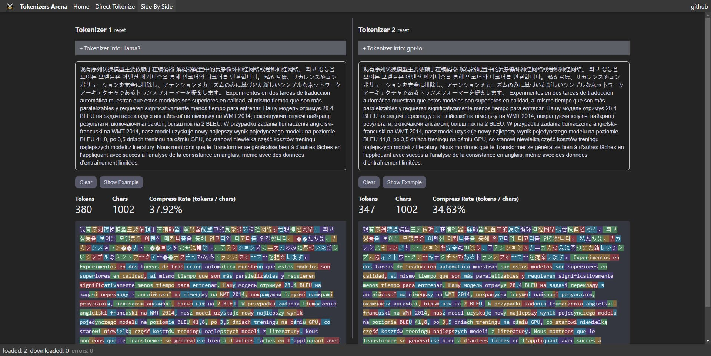

# @lenml/tokenizers

This is the central repository for the `@lenml/tokenizers` project, which provides tokenization libraries for various machine learning models.

> this repo fork from [huggingface/transformers.js](https://github.com/huggingface/transformers.js/)

# Tokenizer Arena / Playground
Explore our Tokenizer Arena / Playground! This interactive platform allows you to utilize various tokenizers from our @lenml/tokenizers library. Easily load and compare different tokenizers, seeing how they perform with diverse text inputs. Whether you're a professional developer or a machine learning enthusiast, this playground is perfect for gaining insights into the tokenization process of different models and experimenting with their functionalities.

[click to arena page](https://lenml.github.io/tokenizers-arena/#/side-by-side)

[](https://lenml.github.io/tokenizers-arena/#/side-by-side)


# When should I use this instead of transformers.js?
Firstly, the interface and the actual code of the Tokenizer object are completely identical to those in transformers.js. However, when loading a tokenizer with this library, you're allowed to create your model directly from a JSON object without the need for internet access, and without relying on Hugging Face (hf) servers, or local files.

Therefore, this library becomes more convenient when you need to operate offline and only require the use of a tokenizer without the need for ONNX models.

# Packages

Below is a table showcasing all available packages, the models they support, and their respective locations within the repository:

| Package Name            | Supported Model(s)                  | Repository Link                         | NPM Page                          |
|-------------------------|-------------------------------------|-----------------------------------------|-----------------------------------|
| `tokenizers` (core)     | N/A (Core Tokenization Library)     | [@lenml/tokenizers](./packages/tokenizers) | [](https://www.npmjs.com/package/@lenml/tokenizers) 
 |
| `llama3_1`                | Llama 3.1                             | [@lenml/tokenizer-llama3_1](./packages/llama3_1) | [](https://www.npmjs.com/package/@lenml/tokenizer-llama3_1)  |
| `llama2`                | Llama 2 (mistral, zephyr, vicuna)   | [@lenml/tokenizer-llama2](./packages/llama2) | [](https://www.npmjs.com/package/@lenml/tokenizer-llama2)  |
| `llama3`                | Llama 3                             | [@lenml/tokenizer-llama3](./packages/llama3) | [](https://www.npmjs.com/package/@lenml/tokenizer-llama3)  |
| `gpt4o`                 | GPT-4o                              | [@lenml/tokenizer-gpt4o](./packages/gpt4o) | [](https://www.npmjs.com/package/@lenml/tokenizer-gpt4o)  |
| `gpt4`                  | GPT-4                               | [@lenml/tokenizer-gpt4](./packages/gpt4) | [](https://www.npmjs.com/package/@lenml/tokenizer-gpt4)  |
| `gpt35turbo`            | GPT-3.5 Turbo                       | [@lenml/tokenizer-gpt35turbo](./packages/gpt35turbo) | [](https://www.npmjs.com/package/@lenml/tokenizer-gpt35turbo)  |
| `gpt35turbo16k`         | GPT-3.5 Turbo 16k                   | [@lenml/tokenizer-gpt35turbo16k](./packages/gpt35turbo16k) | [](https://www.npmjs.com/package/@lenml/tokenizer-gpt35turbo16k)  |
| `gpt3`                  | GPT-3                               | [@lenml/tokenizer-gpt3](./packages/gpt3) | [](https://www.npmjs.com/package/@lenml/tokenizer-gpt3)  |
| `gemma`                 | Gemma                               | [@lenml/tokenizer-gemma](./packages/gemma) | [](https://www.npmjs.com/package/@lenml/tokenizer-gemma)  |
| `claude`                | Claude 2/3                          | [@lenml/tokenizer-claude](./packages/claude) | [](https://www.npmjs.com/package/@lenml/tokenizer-claude)  |
| `claude1`               | Claude 1                            | [@lenml/tokenizer-claude1](./packages/claude1) | [](https://www.npmjs.com/package/@lenml/tokenizer-claude1)  |
| `gpt2`                  | GPT-2                               | [@lenml/tokenizer-gpt2](./packages/gpt2) | [](https://www.npmjs.com/package/@lenml/tokenizer-gpt2)  |
| `baichuan2`             | Baichuan 2                          | [@lenml/tokenizer-baichuan2](./packages/baichuan2) | [](https://www.npmjs.com/package/@lenml/tokenizer-baichuan2)  |
| `chatglm3`              | ChatGLM 3                           | [@lenml/tokenizer-chatglm3](./packages/chatglm3) | [](https://www.npmjs.com/package/@lenml/tokenizer-chatglm3)  |
| `command_r_plus`        | Command-R-Plus                      | [@lenml/tokenizer-command_r_plus](./packages/command_r_plus) | [](https://www.npmjs.com/package/@lenml/tokenizer-command_r_plus)  |
| `internlm2`             | InternLM 2                          | [@lenml/tokenizer-internlm2](./packages/internlm2) | [](https://www.npmjs.com/package/@lenml/tokenizer-internlm2)  |
| `qwen1_5`               | Qwen 1.5                            | [@lenml/tokenizer-qwen1_5](./packages/qwen1_5) | [](https://www.npmjs.com/package/@lenml/tokenizer-qwen1_5)  |
| `yi`                    | Yi                                  | [@lenml/tokenizer-yi](./packages/yi) | [](https://www.npmjs.com/package/@lenml/tokenizer-yi)  |
| `text_davinci002`       | Text-Davinci-002                    | [@lenml/tokenizer-text_davinci002](./packages/text_davinci002) | [](https://www.npmjs.com/package/@lenml/tokenizer-text_davinci002)  |
| `text_davinci003`       | Text-Davinci-003                    | [@lenml/tokenizer-text_davinci003](./packages/text_davinci003) | [](https://www.npmjs.com/package/@lenml/tokenizer-text_davinci003)  |
| `text_embedding_ada002` | Text-Embedding-Ada-002              | [@lenml/tokenizer-text_embedding_ada002](./packages/text_embedding_ada002) | [](https://www.npmjs.com/package/@lenml/tokenizer-text_embedding_ada002)  |
| `gemma2`              | Gemma 2 / gemini-1.0-pro /  gemini-1.5-pro / gemini-1.5-flash   / gemini-nano                       | [@lenml/tokenizer-gemma2](./packages/gemma2) | [](https://www.npmjs.com/package/@lenml/tokenizer-gemma2)  |
| `gemini`              | Gemma 2 / gemini-1.0-pro /  gemini-1.5-pro / gemini-1.5-flash   / gemini-nano                       | [@lenml/tokenizer-gemini](./packages/gemini) | [](https://www.npmjs.com/package/@lenml/tokenizer-gemini)  |
| `qwen2_5`             | Qwen 2.5                             | [@lenml/tokenizer-qwen2_5](./packages/qwen2_5) | [](https://www.npmjs.com/package/@lenml/tokenizer-qwen2_5)  |
| `aya_expanse`         | Aya Expanse                          | [@lenml/tokenizer-aya_expanse](./packages/aya_expanse) | [](https://www.npmjs.com/package/@lenml/tokenizer-aya_expanse)  |
| `llama3_2`            | Llama 3.2                             | [@lenml/tokenizer-llama3_2](./packages/llama3_2) | [](https://www.npmjs.com/package/@lenml/tokenizer-llama3_2)  |
| `mistral_nemo`        | Mistral Nemo                        | [@lenml/tokenizer-mistral_nemo](./packages/mistral_nemo) | [](https://www.npmjs.com/package/@lenml/tokenizer-mistral_nemo)  |


In addition to the pre-packaged models listed above, you can also utilize the interfaces in @lenml/tokenizers to load models independently.

# Usage

## install

### npm/yarn/pnpm
```
npm install @lenml/tokenizers
```

### ESM
```html
<script type="importmap">
  {
    "imports": {
      "@lenml/tokenizers": "https://www.unpkg.com/@lenml/tokenizers@latest/dist/main.mjs"
    }
  }
</script>
<script type="module">
  import { TokenizerLoader, tokenizers } from "@lenml/tokenizers";
  console.log('@lenml/tokenizers: ',tokenizers);
</script>
```

## load tokenizer
### from json
```ts
import { TokenizerLoader } from "@lenml/tokenizers";
const tokenizer = TokenizerLoader.fromPreTrained({
    tokenizerJSON: { /* ... */ },
    tokenizerConfig: { /* ... */ }
});
```

### from urls
```ts
import { TokenizerLoader } from "@lenml/tokenizers";
const sourceUrls = {
    tokenizerJSON: "https://huggingface.co/HuggingFaceH4/zephyr-7b-gemma-v0.1/resolve/main/tokenizer.json?download=true",
    tokenizerConfig: "https://huggingface.co/HuggingFaceH4/zephyr-7b-gemma-v0.1/resolve/main/tokenizer_config.json?download=true"
}
const tokenizer = await TokenizerLoader.fromPreTrainedUrls(sourceUrls);
// or from fetch
const tokenizer = TokenizerLoader.fromPreTrained({
    tokenizerJSON: await fetch(sourceUrls.tokenizerJSON).then(r => r.json()),
    tokenizerConfig: await fetch(sourceUrls.tokenizerConfig).then(r => r.json())
});
```

### from pre-packaged tokenizer
```ts
import { fromPreTrained } from "@lenml/tokenizer-llama3";
const tokenizer = fromPreTrained();
```

## chat template
```ts
const tokens = tokenizer.apply_chat_template(
  [
    {
      role: "system",
      content: "You are helpful assistant.",
    },
    {
      role: "user",
      content: "Hello, how are you?",
    },
  ]
) as number[];

const chat_content = tokenizer.decode(tokens);

console.log(chat_content);
```
output:
```
<|begin_of_text|><|start_header_id|>system<|end_header_id|>

You are helpful assistant.<|eot_id|><|start_header_id|>user<|end_header_id|>

Hello, how are you?<|eot_id|><|start_header_id|>assistant<|end_header_id|>
```

## tokenizer api
```ts
console.log(
    "encode() => ",
    tokenizer.encode("Hello, my dog is cute", null, {
        add_special_tokens: true,
    })
);
console.log(
    "_encode_text() => ",
    tokenizer._encode_text("Hello, my dog is cute")
);
```

> fully tokenizer api: [transformer.js tokenizers document](https://huggingface.co/docs/transformers.js/api/tokenizers)

## get lightweight `transformers.tokenizers`
In the `@lenml/tokenizers` package, you can get a lightweight no-dependency implementation of tokenizers:

> Since all dependencies related to huggingface have been removed in this library, although the implementation is the same, it is not possible to load models using the form `hf_user/repo`.

```ts
import { tokenizers } from "@lenml/tokenizers";

const {
    CLIPTokenizer,
    AutoTokenizer,
    CohereTokenizer,
    VitsTokenizer,
    WhisperTokenizer,
    // ...
} = tokenizers;
```

## Manual Packaging

In some cases, you may need to use an older version of Node.js, so you might not be able to use pre-packaged packages. In such situations, you can manually package starting from the .ts files.

Here's a simple example:

```ts
import {
  tokenizerJSON,
  tokenizerConfig,
} from "@lenml/tokenizer-claude/src/data.ts";
import { TokenizerLoader } from "@lenml/tokenizers/src/main.ts";

export const tokenizer = TokenizerLoader.fromPreTrained({
  tokenizerConfig,
  tokenizerJSON,
});
```

## Performance Benchmark Results

The following table summarizes the performance benchmarks for the `Llama31` and `GPT4o` tokenizers across various datasets. The performance is measured in operations per second (ops/sec), indicating how efficiently each tokenizer processes the given input.

| Tokenizer | Operation           | Text     | Performance (ops/sec) | Margin of Error (±%) | Sampled Runs |
|-----------|---------------------|----------|-----------------------|----------------------|--------------|
| Llama31   | encode              | English  | 27,260                | 0.81%                | 86           |
| Llama31   | encode              | Chinese  | 50,675                | 0.81%                | 89           |
| Llama31   | encode              | French   | 22,836                | 0.58%                | 92           |
| Llama31   | encode              | Code     | 17,677                | 0.30%                | 94           |
| Llama31   | decode              | English  | 16,542                | 0.61%                | 90           |
| Llama31   | decode              | Chinese  | 21,118                | 0.39%                | 90           |
| Llama31   | decode              | French   | 12,994                | 0.24%                | 91           |
| Llama31   | decode              | Code     | 10,350                | 2.80%                | 87           |
| GPT4o     | encode              | English  | 31,618                | 0.74%                | 92           |
| GPT4o     | encode              | Chinese  | 73,120                | 0.74%                | 92           |
| GPT4o     | encode              | French   | 27,838                | 3.40%                | 91           |
| GPT4o     | encode              | Code     | 19,589                | 3.05%                | 87           |
| GPT4o     | decode              | English  | 24,723                | 0.73%                | 91           |
| GPT4o     | decode              | Chinese  | 44,201                | 0.33%                | 92           |
| GPT4o     | decode              | French   | 21,924                | 0.39%                | 90           |
| GPT4o     | decode              | Code     | 15,785                | 0.55%                | 94           |

The benchmarking script used to generate these results can be found at `./packages/tests/benchmarks/main.ts`. You can use this script to replicate the benchmarks and validate the performance metrics for yourself.


# License

Apache-2.0